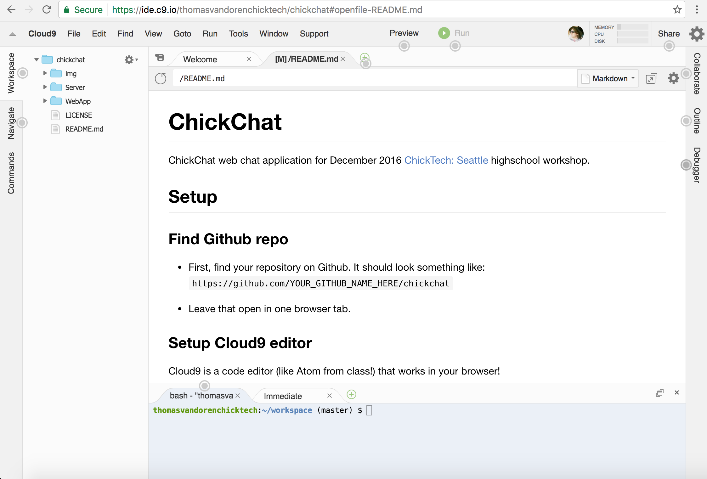
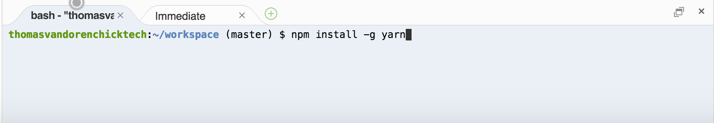
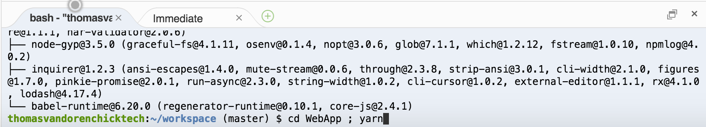
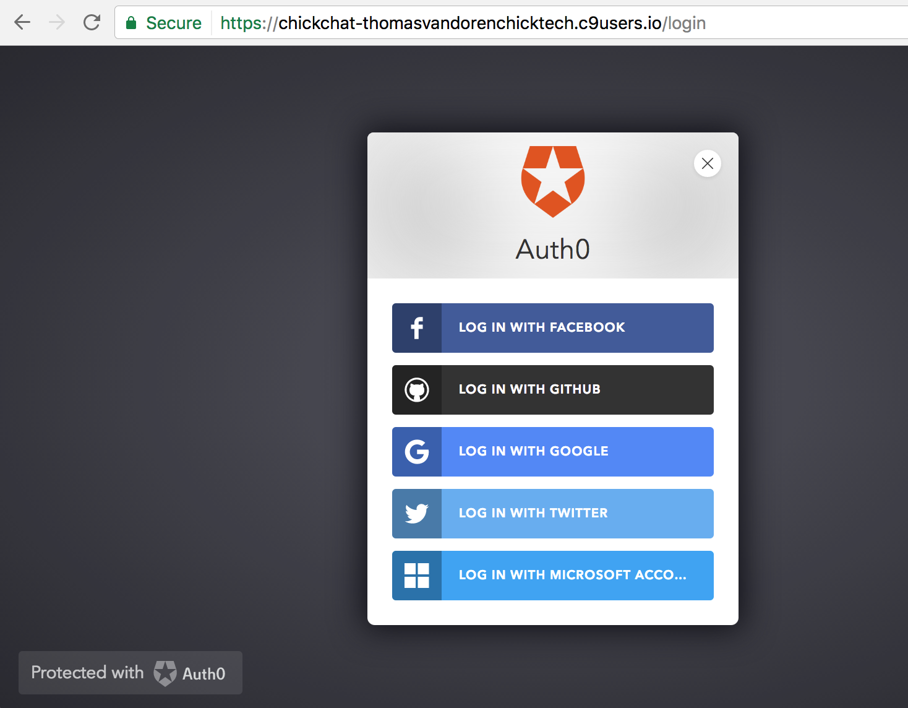

# ChickChat

ChickChat web chat application for December 2016
[ChickTech: Seattle](http://seattle.chicktech.org/) highschool workshop.

## Setup

### Find Github repo

* First, find your repository on Github. It should look something like:
  `https://github.com/YOUR_GITHUB_NAME_HERE/chickchat`

* Leave that open in one browser tab.

### Setup Cloud9 editor

[Cloud9][c9-home] is a code editor (like Atom from class!) that works in your browser!

You should have an invite in your personal email to join the ChickTech team on
Cloud9. If you do not have an invite, please contact Thomas at
thomas.vandoren@chicktech.org.

* Open the link in the email in a Chrome browser.

* Select "Create new account", and fill out the form on the next few pages.

* Once you have registered for an account, you will see the "Welcome to Cloud9
  Teams" screen. Select "Join team"!

* You will receive an email asking to reset your password.. Open the email, and
  follow the link to set a password.

* Once you are signed in, you will see the Cloud9 dashboard.

* Select "Create a new workspace"!

* Give your workspace a name. **It must begin with chichchat**.

* In the "Clone from Git or Mercurial URL" section, enter the URL of your
  Github repo. It should look something like:
  `https://github.com/YOUR_GITHUB_USERNAME/chickchat.git`

* Under "Choose a template", select `Node.js` box.

* Select "Create workspace"

* After a few seconds (or a minute) your code editor (or interactive
  development environment (IDE)) will open.

### Dev environment setup

* Click into the bottom box (your terminal), and enter: `npm install -g yarn`
  . Then press Enter and wait for the command to finish running.

* Enter this command next: `cd WebApp ; yarn` . Then press Enter.

After command finishes, you should see something like this:

* Press the green plus mark and choose "New Run Configuration".

* Enter `Run WebApp` in the first dark grey box.

* Enter `yarn start` in the second dark grey box.

* Select the `CWD` button, and choose the WebApp directory.

* The bottom screen section should now look like this:

* Click the `Run` button to start the chat application! When it's running it
  should look like:

* To view the app, select Preview from the top menu, then `Preview Running Application`:

* Your web app will open in a new tab in the editor. You can cut+paste the URL
  into a new tab.

* For example, my url is: https://chickchat-thomasvandorenchicktech.c9users.io/

Now your app is running!

### Making changes

Now that your app is running, you can open files, edit them, and then save. The
changes will automatically show up (it takes a few seconds sometimes) just like
in class. Make sure you save, though!

## Suggested features

0. Make all author images a circle.

0. Add conditional formatting so that all your messages have a different style
  than everyone else.

0. Use CSS animation to change the colors of the messages back-and-forth on the page.

0. Use CSS animation to grow the message when the mouse hovers over them.

0. Use CSS animation to spin images on page.

0. Use CSS to animate the image only when the mouse hovers over the image.

0. Implement the image upload if you didn't get a chance in class. Hint: look at
  the comments in
  [WebApp/src/util/attachImage.js](WebApp/src/util/attachImage.js).

0. The [Material-UI](http://www.material-ui.com/) library is included in the
  project. Replace some of your HTML in Chat.js render() method with
  Material-UI components for a modern web look.

0. Show an animation when someone says a particular word. For example, if
  someone says "pumpkin", you could make it rain pumpkins on your screen!
